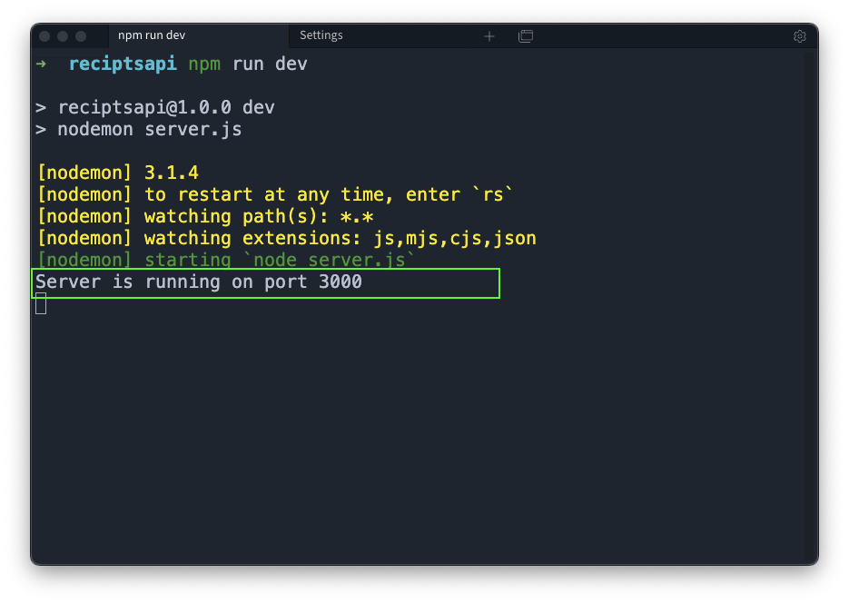
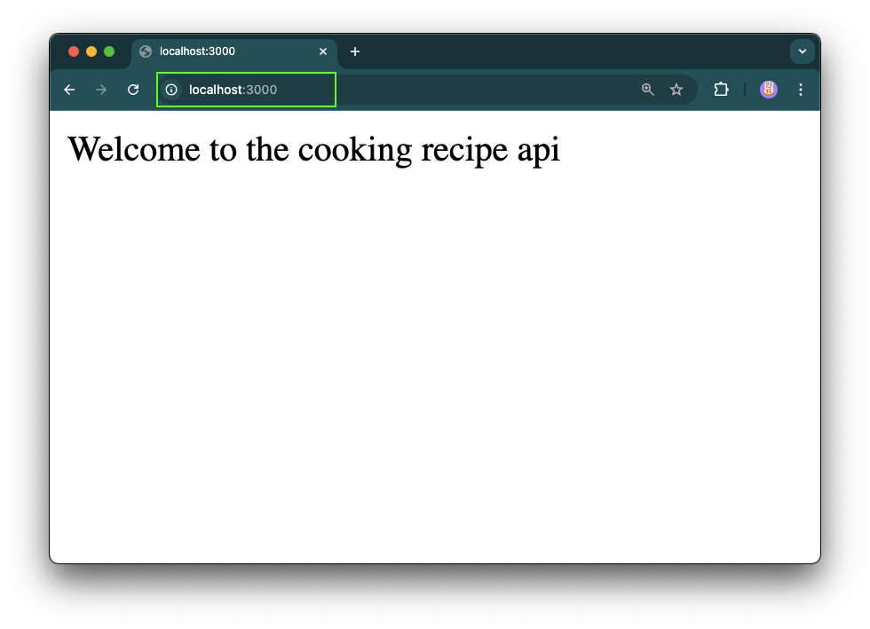
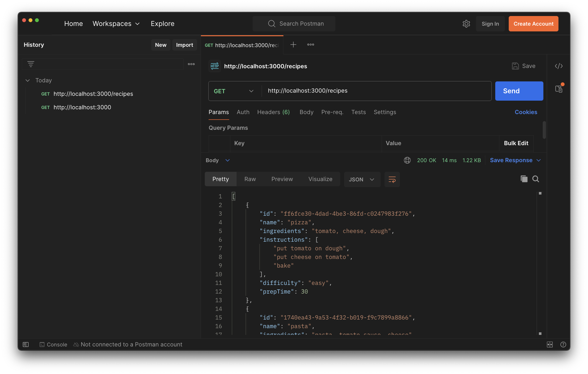
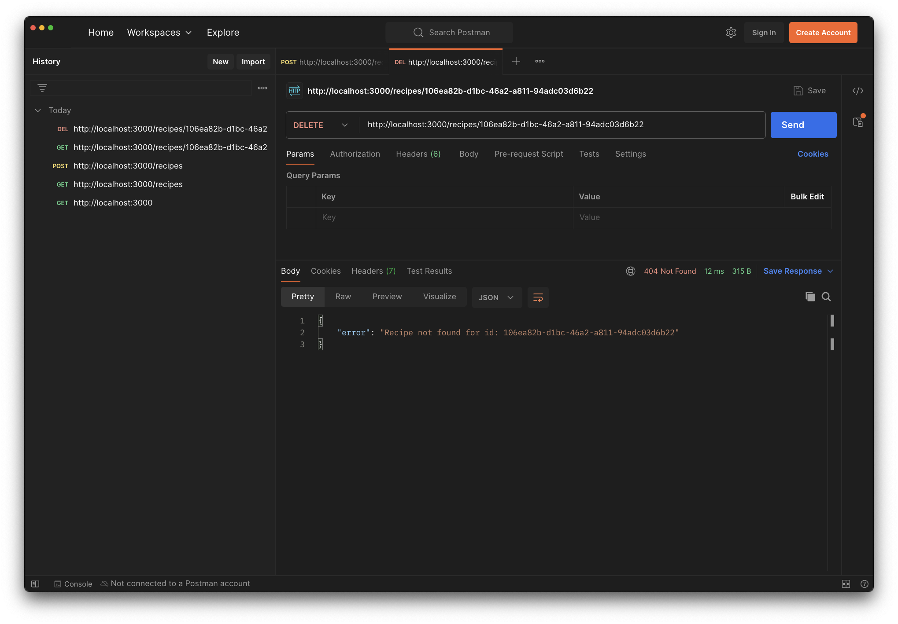

# **Veiledet Oppgave: Bygging av en Matoppskrifts-API**

#### **Mål:**

Ved slutten av denne oppgaven skal studentene ha laget et RESTful API for å administrere matoppskrifter ved hjelp av Express.js. Dette API-et skal tillate brukere å opprette, lese, oppdatere og slette oppskrifter, samt søke etter oppskrifter basert på forskjellige kriterier.

#### **Forutsetninger:**

* Grunnleggende kunnskaper om JavaScript og Node.js
* Kjennskap til Express.js
* Forståelse for RESTful API-konsepter

---

### **Del 1: Oppsett av prosjektet**

#### Steg 1: Initialiser prosjektet

1. Lag en ny mappe for prosjektet ditt og naviger inn i den:

   ```bash
   mkdir cooking-recipe-api 
   cd cooking-recipe-api 
   ```

2. Initialiser et nytt Node.js-prosjekt:

   ```bash
   npm init -y
   ```

   > [Merk!] ***-y*** flagget vil akseptere alle instillingene som default i package.json
   >
3. Installer Express.js som en avhengihet(dependencie):

   ```bash
   npm install express 
   ```

   > [Merk!] Du kan installere flere pakker samtidig ved å liste de med mellomrom
   >
4. Installer Nodemon som en utvikler avhengihet (devDependencie):

   ```bash
   npm install --save-dev nodemon
   # or 
   npm i -D nodemon
   ```

   > [Tips!] Mange applikasjoner har en lang og en kort versjon av argumenter.
   > For eksempel kan du bruke **i** isteden for **install**
   > og **-D** isteden for **--save-dev**
   >
5. Verifiser og oppdater **package.json** filen som blir opprettet.

    > OBS! \
    > RØDE linjer skal fjernes \
    > GRØNNE linjer skal legges til

   ```diff
   {
       "name": "reciptsapi",
       "version": "1.0.0",
       "description": "",
   -   "main": "index.js",
   +   "main": "server.js",
   +   "type": "module",
       "scripts": {
   -       "test": "echo \"Error: no test specified\" && exit 1",
   +       "dev": "nodemon server.js"
       },
       "keywords": [],
       "author": "Abebe Bediye",
       "license": "MIT",
   +   "dependencies": {
   +       "express": "^4.19.2"
   +   },

   +   "devDependencies": {
   +       "nodemon": "^3.1.4"
   +   }
   }

   ```

#### Steg 2: Sett opp Express-serveren

1. Opprett en fil som heter **server.js.**
2. Sett opp en enkel Express-server som lytter på port 3000

    ```javascript
    import express from 'express' // hvis du bruker type = modules i package.json
    // eller 
    const express = require('express'); // hvis du bruker type = commonjs i package json

    const app = express();
    
    // !OBS dette er en middleware - vi kommer tilbake til dette senere i semesteret
    app.use(express.json()); 

    app.get('/', (req, res) => {
        res.send('Welcome to the Cooking Recipe API');
    });

    const PORT = process.env.PORT || 3000;
        app.listen(PORT, () => {
            console.log(`Server is running on port ${PORT}`);
    });

    ```

3. Kjør serveren og verifiser at den fungerer ved å besøke <http://localhost:3000> i nettleseren din.

    Nå som vi har definert et endepunkt vi kan sende spørringer mot kan vi starte api-serveren vår og lytte etter forespørsler. Vi bruker **dev** skriptet vi definerte i **package.json** i [Steg 1.5](#steg-1-initialiser-prosjektet)

    ```bash
    npm run dev 
    ```

    > [Merk!] **dev** er nøklen vi definerete i scripts blokken i package.json

    
    
    

---

### **Del 2: Utforming av oppskrifts-API**

#### Steg 3: Definer oppskriftsmodellen

* Lagre oppskriftene i et array i minnet (dette vil du senere erstatte med en database).
* Implementer en rute for å motta forespørsel på *alle* oppskrifter.
* Oppskriftsdataene skal sendes i forespørselskroppen som JSON.
* Generer en unik id for hver oppskrift.

1. Bestem strukturen på en oppskrift (dette kalles en **datamodell** eller bare **modell**). En oppskrift kan inkludere følgende felt:

   ```javascript
   {
       id: string // unik identifikator
       name: string  // navn på retten
       ingredients: [] // liste med ingredienser
       instructions: [] // tilberedningsinstruksjoner
       difficulty: ''  // vanskelighetsgrad på oppskriften
       prepTime: 45 // tilberedningstid i minutter
   }
   ```

    > [Valgfritt] Vi skal bruke dennemodellen til å  lage en liste med objekter som vi skal sende i responsen.\
    > Installer **@faker-js/faker** for å slippe å finne på matvarer manuelt  

    ```bash
    npm i -D @faker-js/faker/
    ```

   Oppgave: Skriv ned modellen for oppskriftsdataene i en kommentar i toppen av en ny fil som du kaller **recipes.js**. Lag og exporter en liste som inneholder noen oppskrifter som har samme *"form"* som modellen på toppen.

    ```javascript
    // recipes.js


    import { faker } from "@faker-js/faker";

    // {
    //     id: string // unik identifikator
    //     name: string  // navn på retten
    //     ingredients: [] // liste med ingredienser
    //     instructions: [] // tilberedningsinstruksjoner
    //     difficulty: ''  // vanskelighetsgrad på oppskriften
    //     prepTime: 45 // tilberedningstid i minutter
    // }

    export const recipes = [
        {
            id: faker.string.uuid(),
            name: "pizza",
            ingredients: "tomato, cheese, dough",
            instructions: ["put tomato on dough", "put cheese on tomato", "bake"],
            difficulty: "easy",
            prepTime: 30,
        },
        {
            id: faker.string.uuid(),
            name: "pasta",
            ingredients: "pasta, tomato sauce, cheese",
            instructions: [
                "boil pasta",
                "put tomato sauce on pasta",
                "put cheese on tomato sauce",
            ],
            difficulty: "easy",
            prepTime: 20,
        },
        {
            id: faker.string.uuid(),
            name: "cake",
            ingredients: "flour, sugar, eggs",
            instructions: ["mix flour and sugar", "add eggs", "bake"],
            difficulty: "medium",
            prepTime: 60,
        },
        {
            id: faker.string.uuid(),
            name: "soup",
            ingredients: "water, vegetables, salt",
            instructions: ["boil water", "add vegetables", "add salt"],
            difficulty: "easy",
            prepTime: 30,
        },
        {
            id: faker.string.uuid(),
            name: "salad",
            ingredients: "lettuce, tomato, cucumber",
            instructions: ["wash lettuce", "cut tomato and cucumber", "mix"],
            difficulty: "easy",
            prepTime: 15,
        },
    ];

    ```

2. Importer **recipes** fra **recipes.js** i **server.js** og lag en ny *route* som responderer på **GET** kall til endepunktet **/recipes** med listen fra recipes som importeres

    ```diff
    // server.js
    
        import express from "express";
    +   import { recipes } from "./recipes.js";
        const app = express();
        const port = 3000;

        app.use(express.json());

        app.get("/", (req, res) => {
            res.send("Welcome to the cooking recipe api");
        });

    +   app.get("/recipes", (req, res) => {
    +       res.json(recipes);
    +   });

        app.listen(port, () => {
            console.log(`Server is running on port ${port}`);
        });

    ```

3. Naviger til <http://localhost:3000/recipes> i nettleser eller i postman og verifiser at du får ut data i respons.



#### Steg 4: Implementer resten av CRUD-operasjoner

1. Opprett en oppskrift (POST /recipes):

   * Implementer en rute for å legge til en ny oppskrift.
   * Oppskriftsdataene skal sendes i forespørselskroppen som JSON.
   * Generer en unik id for hver oppskrift.
   * Legg til oppskriften i recipes listen i minnet (dette vil du senere erstatte med en database).

   Oppgave:

   ```javascript

    ...

    app.get("/recipes", (req, res) => {
        res.json(recipes);
    });

    // add a new routhandler but now use POST instead of GET
    app.post("/recipes", (req, res) => {
        // validate inputdata
        if (!req.body) {
            return res.status(400).json({ error: "Inputdata is missing" });
        }

        if (!req.body.name) {
            return res.status(400).json({ error: "Name is missing" });
        }

        // generate new recipe
        const new_id = faker.string.uuid();
        const rest_of_recipe_information = req.body;

        // note the three dots before rest_of_recipe_information - it is called a spread-operator in javascript
        // https://www.w3schools.com/howto/howto_js_spread_operator.asp
        const recipe = { id: new_id, ...rest_of_recipe_information };

        // add the new recipe to the list of recipes
        recipes.push(recipe);

        // Optional - Log id and name of all recipes to console
        console.log(
            "Recipe added: ",
            recipes.map((r) => ({ id: r.id, name: r.name }))
        );

        // return the new recipe as a response
        res.status(201).json(recipe);
    });

    ...

   ```

2. Les en enkelt oppskrift (GET /recipes/:id):

   * Implementer en rute for å hente en enkelt oppskrift basert på id.
   * Hvis oppskriften ikke finnes, returner en 404-status med en passende melding.

   Eksempel:

   ```javascript

    ...

    app.get("/recipes/:id", (req, res) => {
        // we are now using the id from the urls :id parameter instead of the body of the request
        const requested_id = req.params.id;

        // find the recipe with the requested id
        const recipe = recipes.find((r) => r.id === requested_id);

        if (recipe) {
            // if the recipe is found, return it as a response
            res.json(recipe);
        }
        else {
            // if the recipe is not found, return an error response
            res.status(404).json({
                error: `Recipe not found for id: ${requested_id}`,
            });
        }
    });

    ...

   ```

3. Oppdater en oppskrift (PUT /recipes/:id):

   * Implementer en rute for å oppdatere en eksisterende oppskrift.
   * Erstatt oppskriften med de oppdaterte dataene.

   Eksempel:

   ```javascript
   app.get("/recipes/:id", (req, res) => {
        // we are now using the id from the urls :id parameter instead of the body of the request
        const requested_id = req.params.id;

        // find the recipe with the requested id
        const recipe = recipes.find((r) => r.id === requested_id);

        if (recipe) {
            // if the recipe is found, return it as a response
            res.json(recipe);
        }
        else {
            // if the recipe is not found, return an error response
            res.status(404).json({
                error: `Recipe not found for id: ${requested_id}`,
            });
        }
    });
   ```

4. Slett en oppskrift (DELETE /recipes/:id):

   * Implementer en rute for å slette en oppskrift basert på id.
   * Fjern oppskriften fra arrayet.

   Eksempel:

    ```javascript

    ...

    app.delete("/recipes/:id", (req, res) => {
        const requested_id = req.params.id;

        // find the index of the recipe with the requested id
        const index = recipes.findIndex((r) => r.id === req.params.id);

        if (index !== -1) {
            // if the recipe is found, remove it from the list of recipes
            recipes.splice(index, 1);
            res.status(204).send();
        } else {
            // if the recipe is not found, return an error response
            res.status(404).json({
                error: `Recipe not found for id: ${requested_id}`,
            });
        }
    });

    ...

    ```

    
